# Train diabetes predictor model using hyperparameter tuning and AutoML on diabetes dataset from UCI 

The objective of this project is to predict the likelihood of person developing diabetes using different ML models and AzureML studio. In this project I created two models: one using AutoML and a second using a custom Support Vector Machine model with various hyperparameters tuned using HyperDrive.  The open source diabetes dataset was downloaded from UCI Machine Learning Repository, transformed and then uploaded to AzureML studio.  

Once AutoML and HyperDrive training was complete, the models were evaluated and the best performing of each was deployed to an Azure endpoint.  The endpoints were quered with unseen data to validate the model performance.  I used Postman to build the REST query, submit to the Azure endpoint, and view the result.

This is a useful project as it demonstrates predictive analytics capabilities of ML applied to a healthcare example.  Ample clinical data exists in medical records, clinical notes, pharmacy systems, etc., that can be evaluated to aid in managing care of patient populations.  

This end-to-end ML example shows how a existing clinical dataset can be used to build a diabetes prediction model and then query the model to predict if a new individual will likely develop diabetes.  This Azure ML framework can be enhanced with additional data to improve performance nd or trained on new data for other clinical applications.  

### Preliminary steps overview

Before loading the data and developing the models, the first steps in the process for both the hyperdrive and AutoML models are:

* Initialize the workspace
* Create a compute cluster target 
* Create an experiment to track the training runs
* Create an Conda and sklearn environment

## Diabetes Prediction Dataset overview

The dataset used in this model is from the UCI Machine Learning Repository: 
https://archive.ics.uci.edu/ml/datasets/Early+stage+diabetes+risk+prediction+dataset.

The dataset contains 520 entries, 16 independent variables, and 1 dependent variable.  The data was collected using direct questionnaires from the patients of Sylhet Diabetes Hospital in Sylhet, Bangladesh and approved by a doctor.  

After downloading the dataset, the fields were evaluated and transformed in excel.  The binary text objects were transformed to 0 or 1, age was scaled to between 0-1.  

## Diabetes Prediction Dataset upload process

The dataset was uploaded to AzureML Datasets using the UI.  Dataset is shown below:

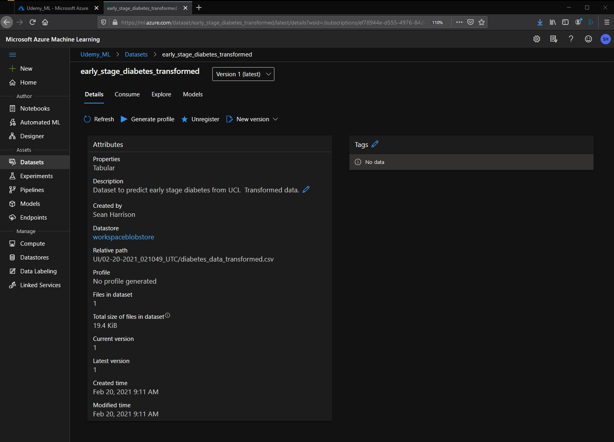

Below is an explore view of the dataset:

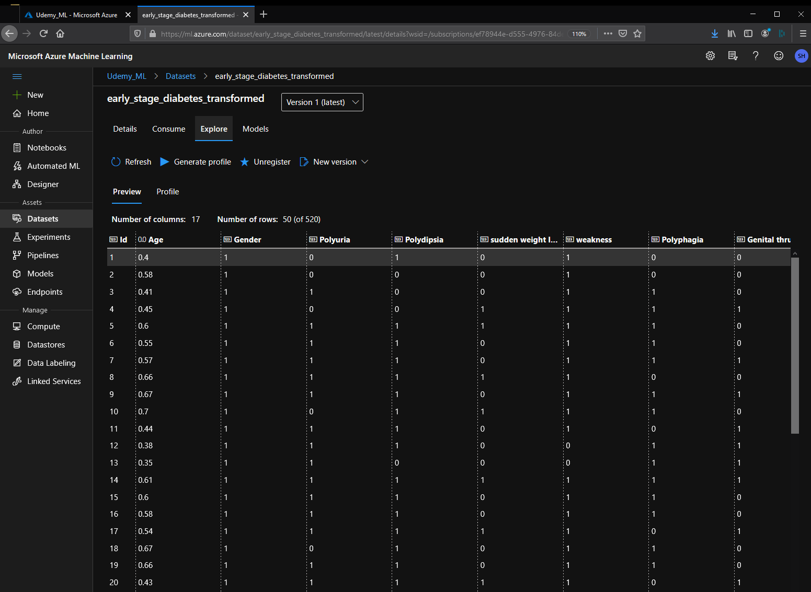

## Hyperparameter experiment parameters and settings

The first step in building the hyperparameter run is to configure and run the training job using ScriptRunConfig.  This step defines the training enviroument, compute target, training script and default parameters. 

The next step is to configure the hyperparameters using HyperDriveConfig.  The two hyperparameters defined for the SVM runs and their range values are:
* kernels - choice('linear', 'rbf', 'poly', 'sigmoid')
* penalty (or C) - choice(0.5, 1, 1.5) values.  

RandomParameterSampling was used to randomly select parameters from the search space during trainig.  

The kernal parameters are an important role in SVM classification. Here different kernel parameters are used as a tuning parameter to improve the classification accuracy. There are four different types of kernels (Linear, Polynomial, RBF, and Sigmoid) that are popular in SVM classifier. Each type of kernal was used for various hyperparameter tuning runs.

The penalty parameter (also known as C) tells the algorithm how much you care about misclassified points. SVMs, in general, seek to find the maximum-margin hyperplane. A high value for C tells the algorithm that you care more about classifying all of the training points correctly than leaving wiggle room for future data. 

The hyperparameter tuning begins and the runs are submitted.  The process is monitored until completion, the best run is identifed, and registered.  I discuss the performance of the best hyperparameter model along with the best AutoML models in the Model section below.   

## Example of RunDetails for HyperDrive

The screencap below shows an example of the RunDetails for the hyperdrive run.

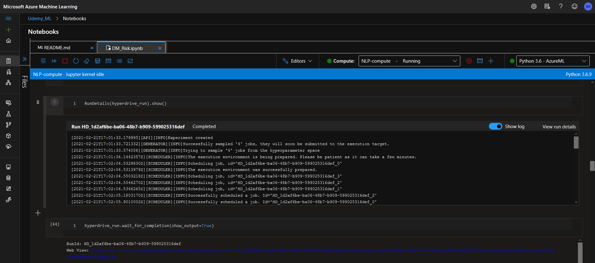

## AutoML experiment settings and configuration

After creating a AutoML experiemnt, the first step is to congigure the AutoML training run with AutoMLConfig.  The objective of this AutoML experiment is to perform classification and optimize around accuracy.  The AutoMLConfig parameters are:
* Task - specify the machine learning task as 'classification'
* primary_metric - define the primary metric as 'accuracy'
* training_data - specifiy the dataset with the variable 'dataset'
* label_column_name - identifiy the label column name as 'class'
* experiment_timeout_minutes - limit long runs to '15' minutes
* max_concurrent_iterations - specifiy max of '4' parallel training runs
* compute_target - specify the compute target set to a compute cluster with variable 'compute_target'
* n_cross_validations - '5' to reduce the likelihood of overfitting the model.

The reason for selecting several of the AutoML parameters are related to 'classifying' diabetes outcomes as positive or negative based on input variables.  The primary task of 'accuracy' since it is a classfication task.  Limiting max concurrent runs to 4 since that is the max nodes configured for the compute cluster, 5 cross validations to reduce the likelihood of overfitting when training.  

Additionally I configured pipeline steps to track output metric and model data using AutoMLSteps and submitted those as part of a piepline.

The next step is to submit the AutoML run and monitor the run details.  

After completion the results of all child runs are examined and the best model identified. 

For the AutoML example, the best performing model was deployed using the UI.

## Example of RunDetails for AutoML

The screencap below shows an example of the RunDetails for the AutoML run.

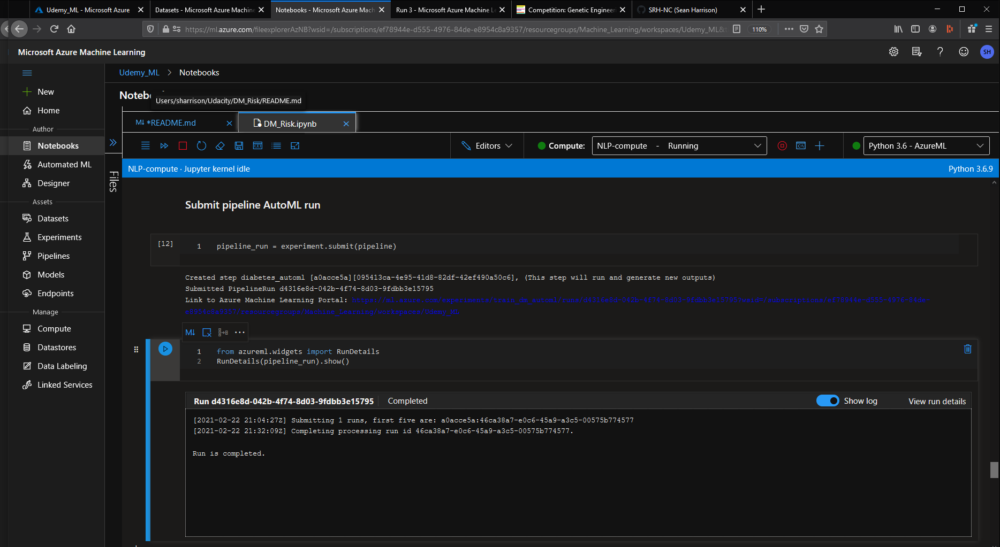

## Overview of the two models with best parameters

Here are the results of the Hyperdrive experiment. 

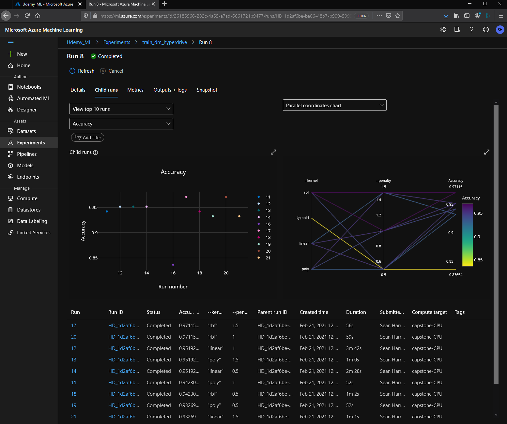

The RBF kernal with a penalty of 1.5 (or 1.0) had the best performance with an accuracy of 0.97115.  

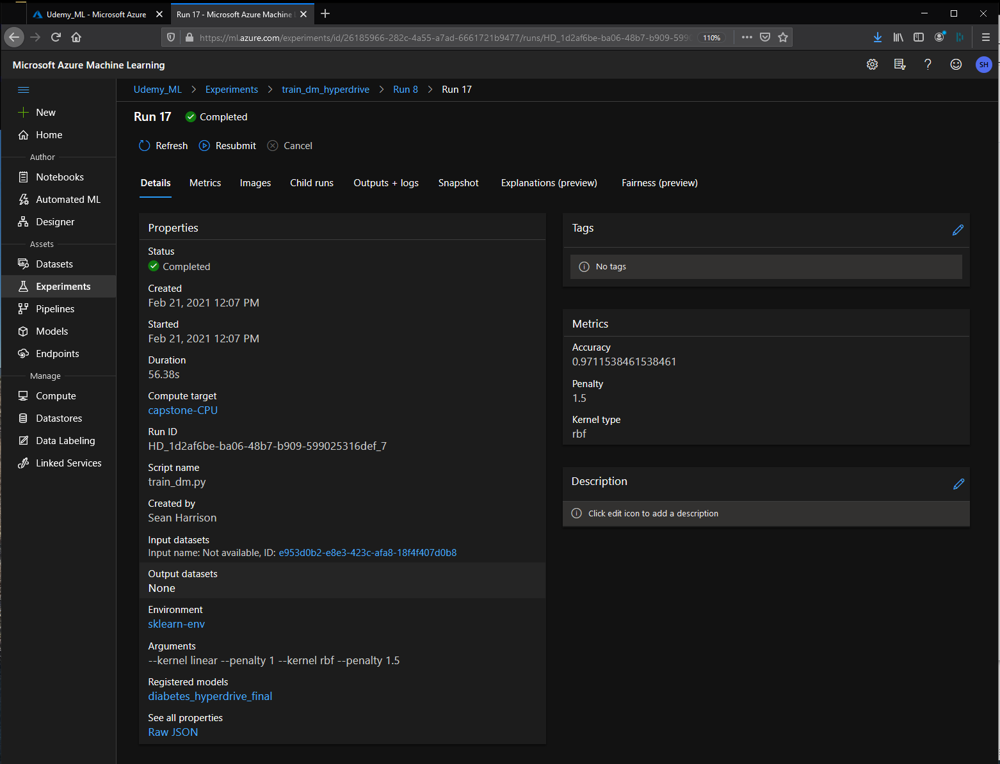

Here are the results of the AutoML experiment. 

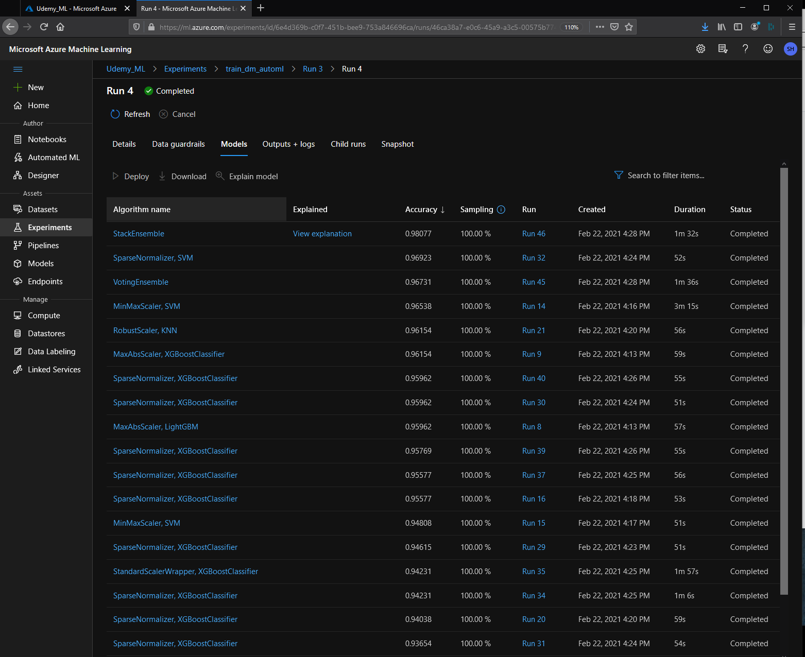

The best performing run, not surprisingly, was an ensemble with an accuracy of 0.981.  

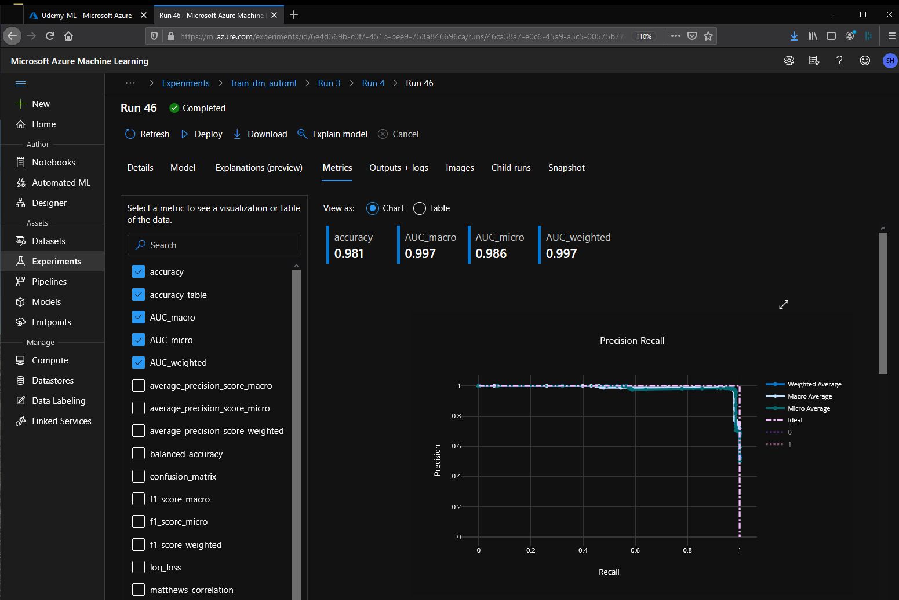

A great feature of the AutoML is the explanation preview that shows what features have the greatest impact on the outcomes.  The screencap below shows that Polyuria and Polydipsia are the most important features in predicting outcomes.  

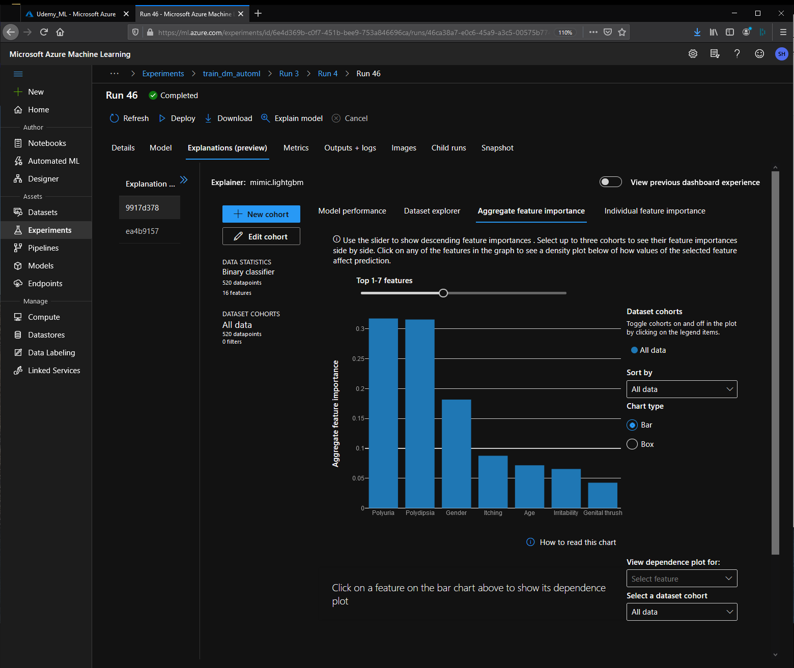

## Overeview of how to query endpoint

The AutoML and Hyperdrive models are both registered and displayed in the Model view in AzureML studio.  They are the first two models listed.  

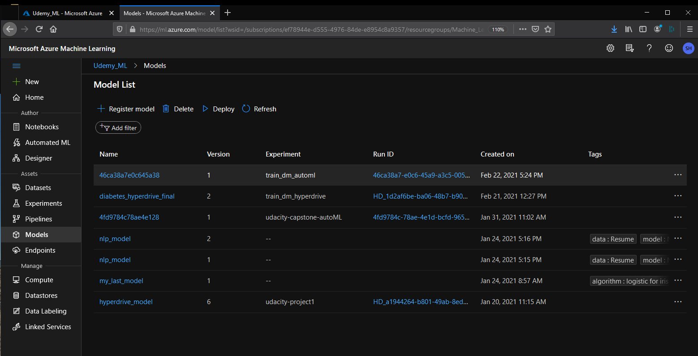

The endpoint for the best performing Hyperdrive model is deployed here:

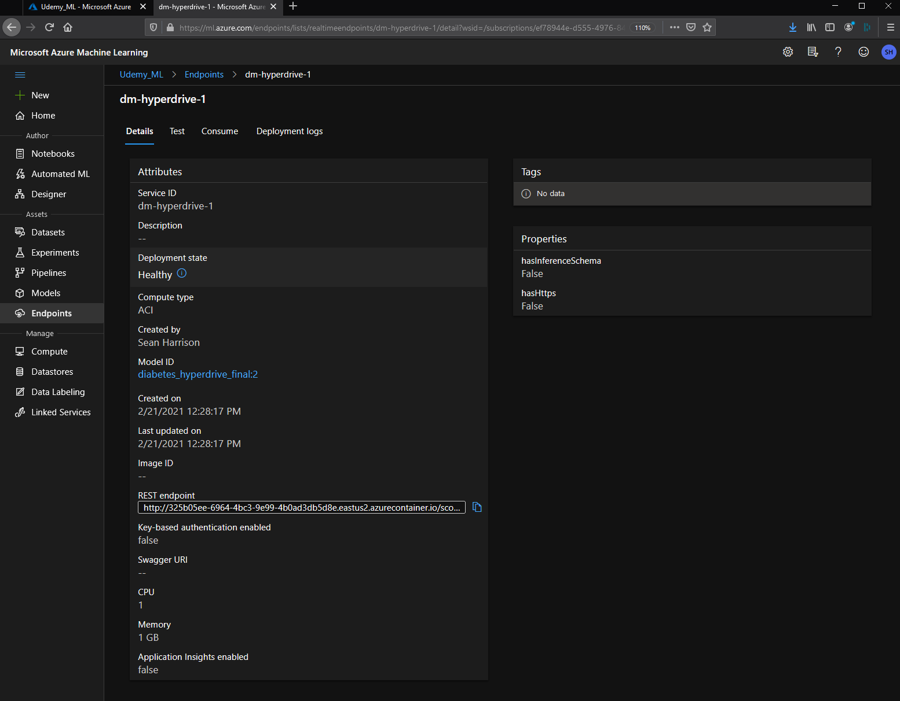

This example uses Postman to query the REST endpoint.  The address in the Post field matches the REST Endpoint above.  Note the '0' or negative result of the query with the parameters in the body.

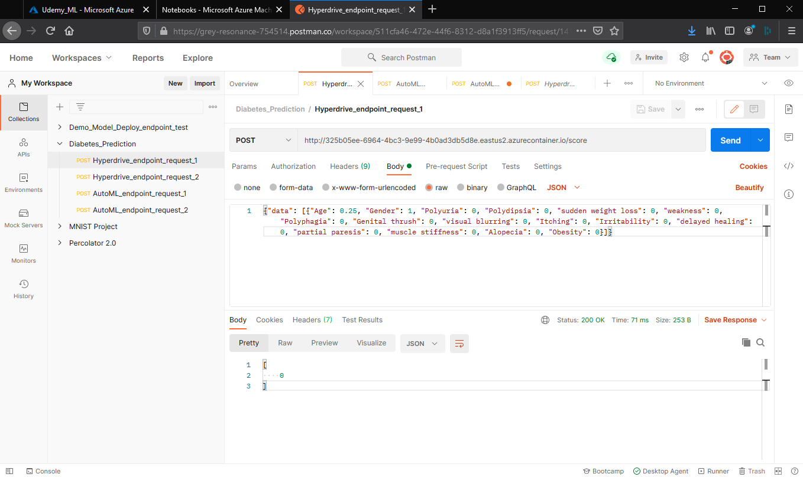

The endpoint for the best performing AutoML model is deployed here: 

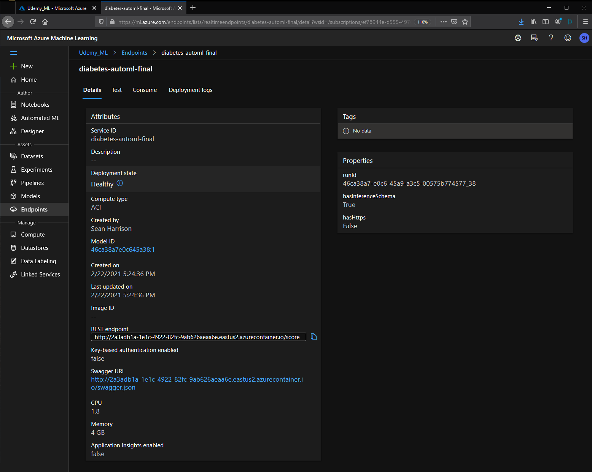

This example also uses Postman to query the REST endpoint.  The address in the Post field matches the REST Endpoint above.  Note the '1' or positive result of the query with the parameters in the body.

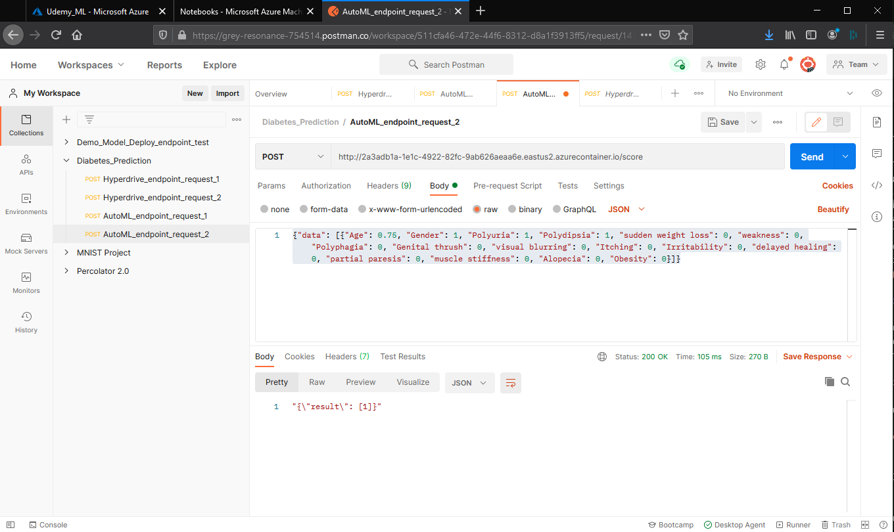

## Overview of how to improve the model in the future

## Screen Recording
Here is a link to a screen recording of the project in action that demonstrates elements of all of the key steps below:

https://vimeo.com/518602818

Steps in Video:
* Overview of Diabetes dataset
* Build Hyperparameter Model
* Build AutoML Model 
* Deploy the best models Hyperparameter and AutoML models 
* Consume model endpoints using REST via Postman application

## How to improve the model in the future

Here are several ideas to improve the model:
* Add more data samples let the 'data better tell the story'
* Instead of binary predictive output, predict outcomes with percentage 
* Treat missing and outlier values to improve accuracy
* Choose other hyperparameters to model the data 
* Enable deep leaning feaures when building models

